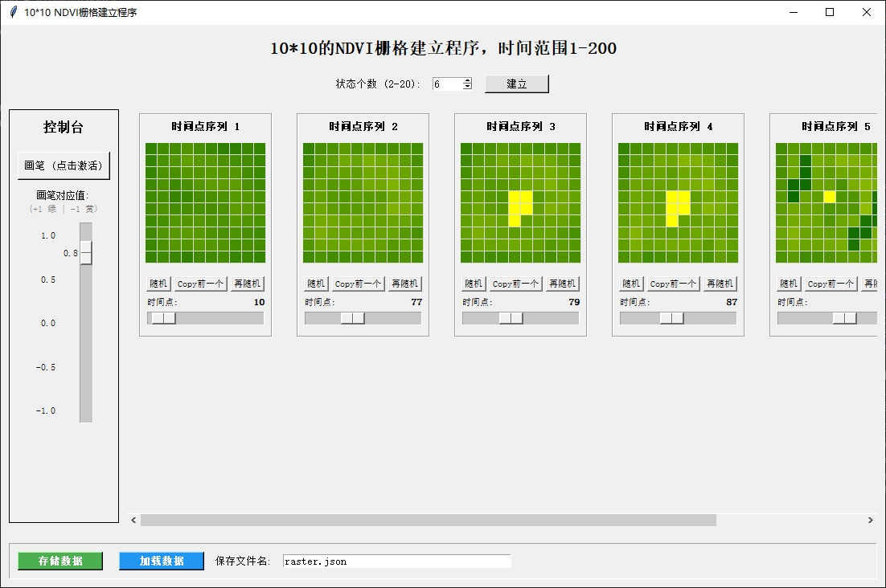
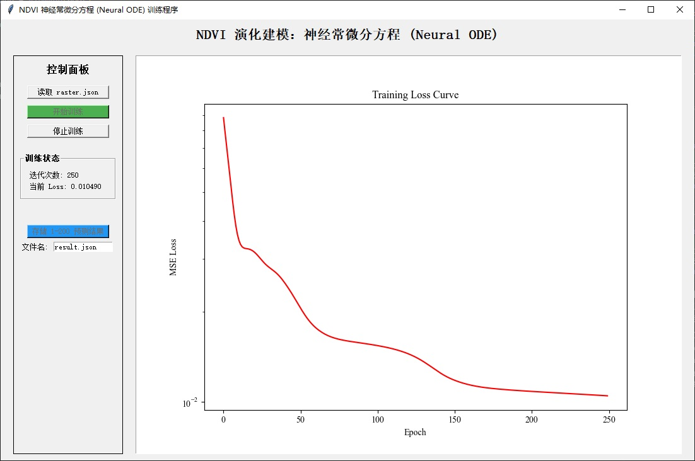
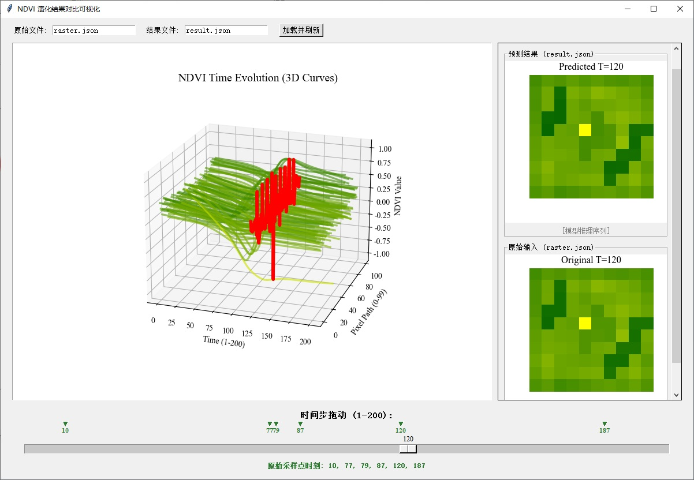
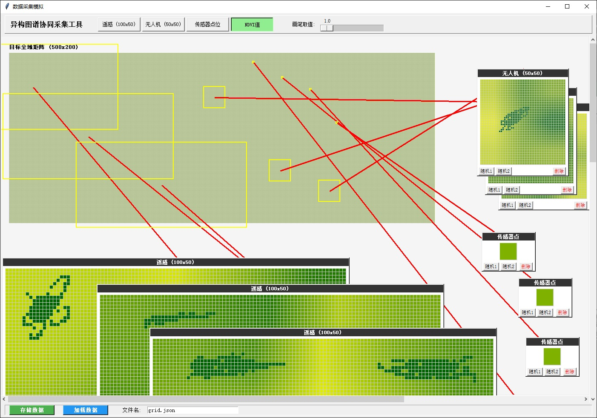
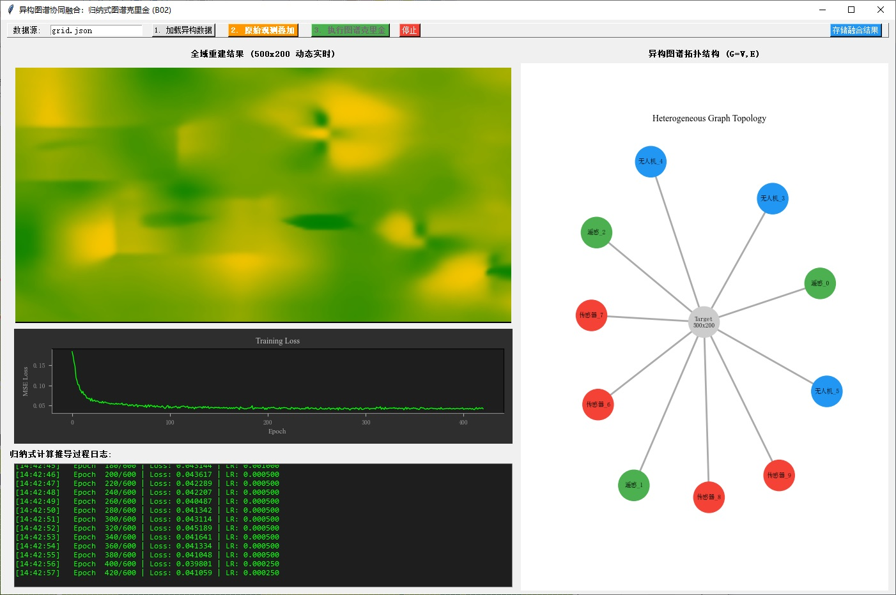
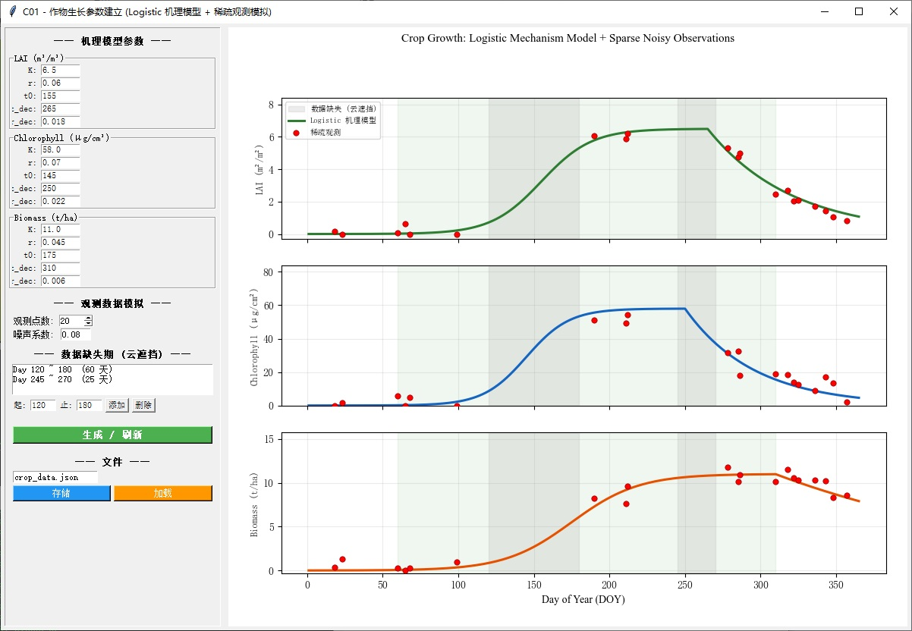
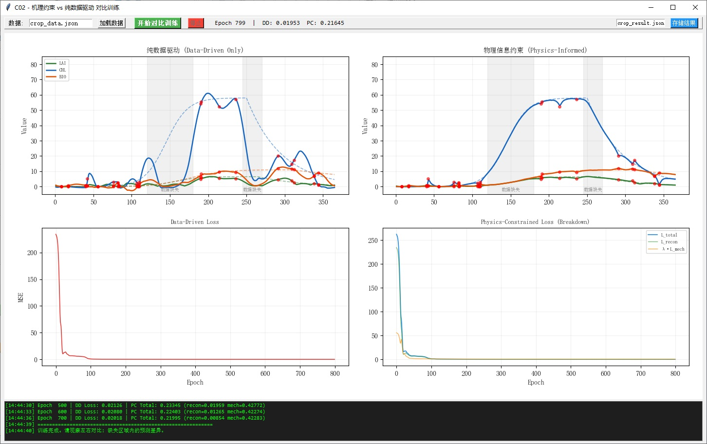
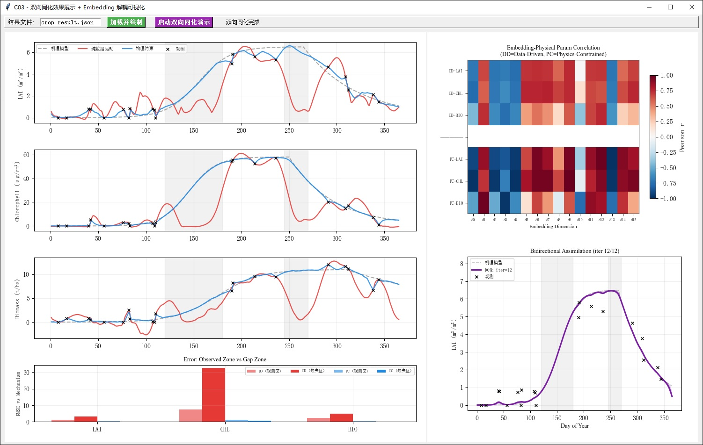

<div align="center">

# 🌾 项目的原型验证程序

### 敬请检查验证

**基于Neural ODE / 异构图神经网络 / 机理约束Embedding的农田时空监测原型系统**


</div>

---

## 📋 项目结构

```
├── A01CreateData.py        # A系列: 数据建立
├── A02Train.py             # A系列: Neural ODE 训练
├── A03viewResult.py        # A系列: 结果三维可视化
├── B01CreateHPData.py      # B系列: 异构数据采集模拟
├── B02HGNN.py              # B系列: 图谱克里金重建
├── C01CreateData.py        # C系列: 作物生长参数建立
├── C02Train.py             # C系列: 机理约束对比训练
├── C03ViewResult.py        # C系列: 双向同化与Embedding分析
├── raster.json             # A系列默认数据
├── result.json             # A系列训练结果
├── grid.json               # B系列默认数据
├── crop_data.json          # C系列默认数据
├── crop_result.json        # C系列训练结果
├── requirements.txt        # 依赖包
├── docs/                   # 运行效果截图
│   ├── PA01.jpg ~ PA03.jpg
│   ├── PB01.jpg ~ PB02.jpg
│   └── PC01.jpg ~ PC03.jpg
└── README.md
```

---

## ⚙️ 安装方法

```bash
pip install -r requirements.txt
```

> **依赖**: numpy, torch, torchdiffeq, matplotlib, Pillow, networkx（tkinter 为 Python 内置模块）

---

## 🚀 运行方法

每个脚本独立运行，无需参数：

```bash
python A01CreateData.py
```

---

## A 系列 — Neural ODE 连续时空 Embedding 场


### A01CreateData.py — NDVI 栅格数据建立

10×10 NDVI 栅格数据的交互式建立，支持画笔编辑、随机生成与时间轴设定。

| 操作 | 说明 |
|---|---|
| **加载默认数据** | 点击 `加载数据` → 自动读取 `raster.json` |
| **存储数据** | 点击 `存储数据` → 保存至文本框指定文件名 |

<div align="center">

</div>

---

### A02Train.py — Neural ODE 训练

加载栅格数据，训练神经常微分方程模型，对 1–200 时间步进行连续演化预测。

| 操作 | 说明 |
|---|---|
| **加载数据** | 文本框默认 `raster.json`，点击 `开始训练` 自动读取 |
| **存储结果** | 训练完成后点击 `存储 1-200 预测结果` → 保存至 `result.json` |

<div align="center">

</div>

---

### A03viewResult.py — 三维时空演化结果对比

三维曲线展示 1–200 时刻的 NDVI 演化场，拖动时间滑条对比原始采样与预测栅格。

| 操作 | 说明 |
|---|---|
| **加载数据** | 文本框默认 `raster.json` + `result.json`，点击 `加载并刷新` |

<div align="center">

</div>

---

## B 系列 — 异构图神经网络多源融合


### B01CreateHPData.py — 多源异构数据采集模拟

模拟遥感（100×50）、无人机（50×50）、传感器（1×1）三种不同分辨率的观测源在 500×200 目标区域上的数据采集。

| 操作 | 说明 |
|---|---|
| **加载默认数据** | 点击 `加载数据` → 自动读取 `grid.json` |
| **存储数据** | 点击 `存储数据` → 保存至 `grid.json` |

<div align="center">

</div>

---

### B02HGNN.py — 归纳式图谱克里金重建

加载异构数据，构建图拓扑结构，通过空间克里金网络融合多源观测，重建全域 NDVI。

| 操作 | 说明 |
|---|---|
| **加载数据** | 文本框默认 `grid.json`，点击 `1. 加载异构数据` |
| **原始叠加** | 点击 `2. 原始观测叠加` → 直接投影原始数据 |
| **图谱克里金** | 点击 `3. 执行图谱克里金` → 训练并重建全域矩阵 |

<div align="center">

</div>

---

## C 系列 — 机理约束与双向同化


### C01CreateData.py — 作物生长参数建立

基于 Logistic 机理模型生成 LAI / 叶绿素 / 生物量 生长曲线，模拟含噪稀疏观测与数据缺失期。

| 操作 | 说明 |
|---|---|
| **加载默认数据** | 点击 `加载` → 自动读取 `crop_data.json` |
| **生成新数据** | 调整参数后点击 `生成 / 刷新` |
| **存储数据** | 点击 `存储` → 保存至 `crop_data.json` |

<div align="center">

</div>

---

### C02Train.py — 机理约束 vs 纯数据驱动对比训练

同一网络架构、同一数据，左右对比：纯数据驱动（缺失区振荡崩溃） vs 物理信息约束（平稳穿越缺失区）。

| 操作 | 说明 |
|---|---|
| **加载数据** | 文本框默认 `crop_data.json`，点击 `加载数据` |
| **开始训练** | 点击 `开始对比训练` → 实时观察左右对比 |
| **存储结果** | 点击 `存储结果` → 保存至 `crop_result.json` |

<div align="center">

</div>

---

### C03ViewResult.py — 双向同化效果与 Embedding 解耦可视化

综合对比机理模型 / 数据驱动 / 物理约束三条曲线；Embedding 维度-物理参数相关性热图；双向同化迭代收敛动画。

| 操作 | 说明 |
|---|---|
| **加载数据** | 文本框默认 `crop_result.json`，点击 `加载并绘制` |
| **双向同化** | 点击 `启动双向同化演示` → 观看迭代收敛动画 |

<div align="center">

</div>

---

## 📂 数据文件说明

| 文件 | 来源 | 内容 |
|---|---|---|
| `raster.json` | A01 输出 | 10×10 NDVI 栅格 + 时间点 |
| `result.json` | A02 输出 | 1–200 时刻 Neural ODE 预测 |
| `grid.json` | B01 输出 | 遥感/无人机/传感器多源观测 |
| `crop_data.json` | C01 输出 | Logistic 机理曲线 + 稀疏观测 |
| `crop_result.json` | C02 输出 | 对比训练结果 + Embedding |

> 所有 JSON 文件内部均包含 `_comment` 字段详细描述数据结构。

---


---

<div align="center">
<sub>本项目为课题申请原型验证程序，仅用于可行性演示。</sub>
</div>

